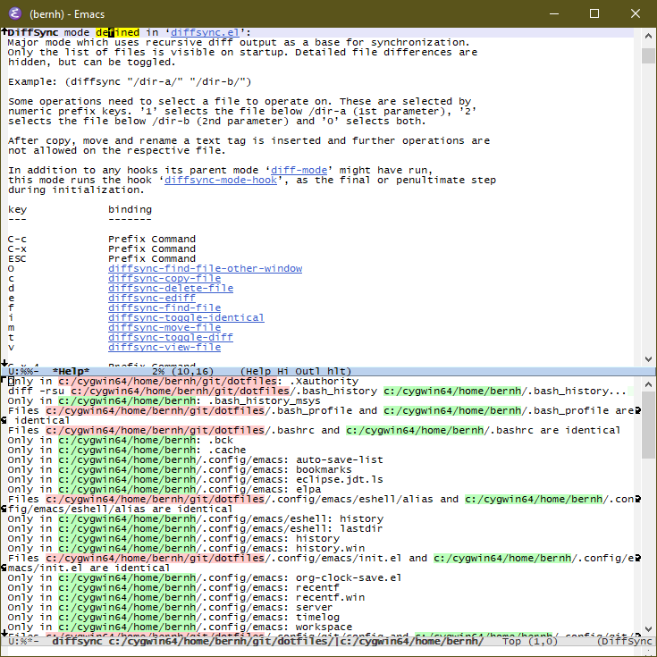

# diffsync
Emacs major mode which uses recursive diff output as a base for synchronization.

Only the list of files is visible on startup. Detailed file differences are hidden, but can be toggled.

There are shortcuts for the following operations: copy, move, delete, ediff, find-file.

